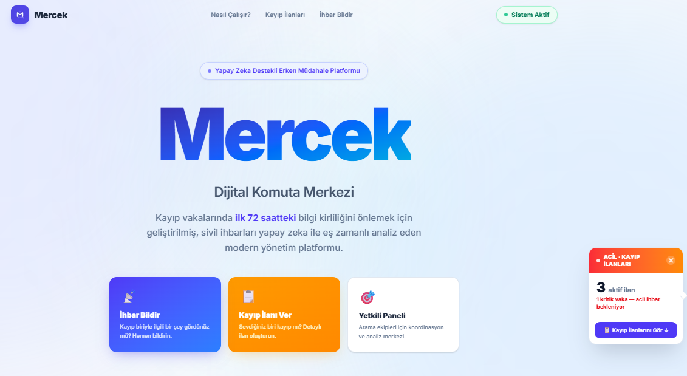
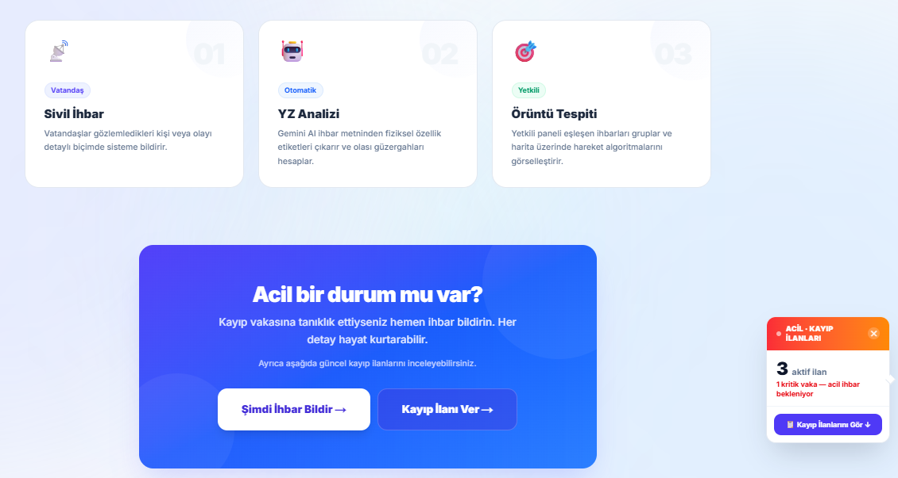
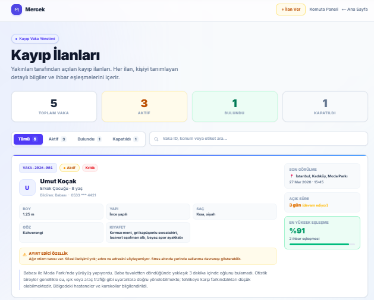
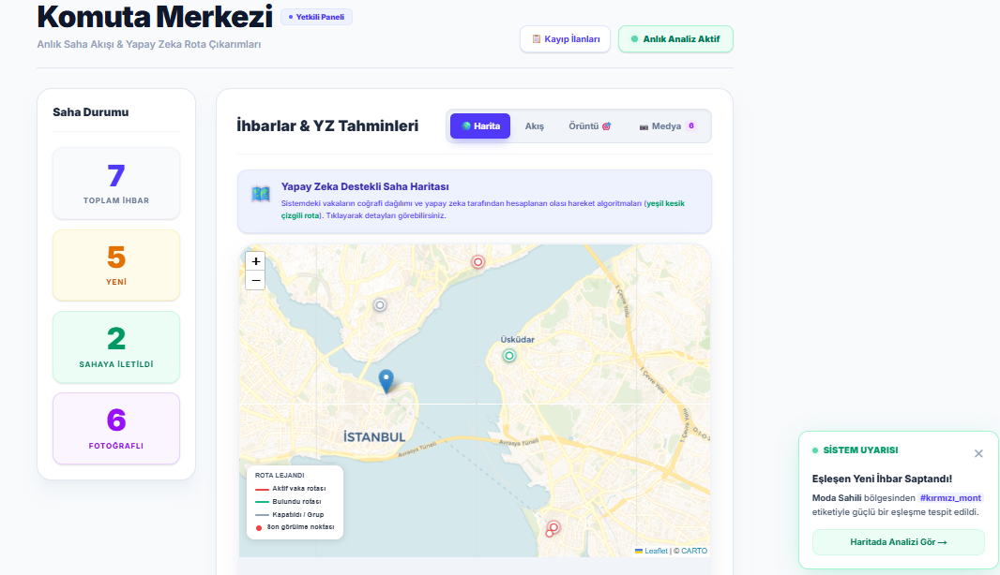
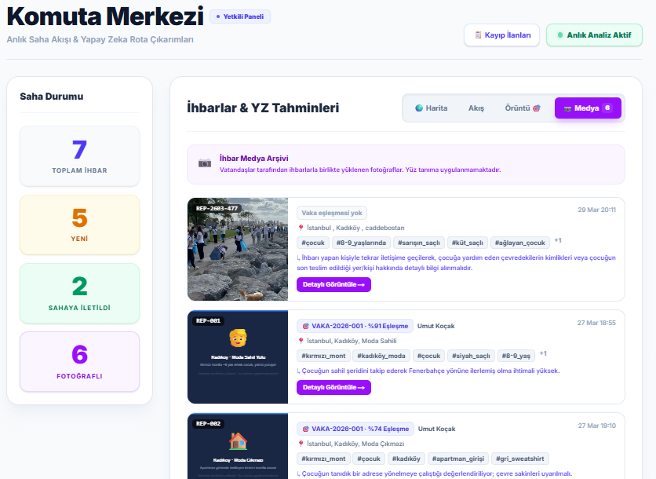

# Mercek — Dijital Komuta Merkezi

> Kayıp vakalarında ilk 72 saatteki bilgi kirliliğini önlemek için geliştirilmiş, sivil ihbarları yapay zeka ile eş zamanlı analiz eden modern yönetim platformu.

<br/>



---

## Canlı Demo

**[mercekupschool.netlify.app](https://mercekupschool.netlify.app/)**

---

## Demo Video

[](https://www.loom.com/share/a2ab070caad64578b1bfdcdc5fdbb5e4)

[Loom üzerinden izlemek için tıklayın](https://www.loom.com/share/a2ab070caad64578b1bfdcdc5fdbb5e4)

---

## Problem

Türkiye'de kayıp vakalarında bilgi yönetiminde yaşanan çeşitli krizler, problemler ve panik sebebiyle yeterince etkin biçimde tamamlanamayabiliyor. Kayıp birey hakkındaki dağınık paylaşımlar yapılabiliyorken gönüllüler ve koordinatörler bu bilgileri manuel olarak takip etmektedir. Kritik ilk 72 saat koordinasyon eksikliği ve bilgi kirliliği içinde geçmektedir.

**Mercek**, bu süreci merkezi ve yapay zeka destekli bir platforma taşır ve organize olmamızı sağlayarak kayıp vakalarındaki insanı sorunları önlemeye yararken aynı zamanda kritik zamanın da kaybolmasının önüne geçmeyi hedefler.

---

## Özellikler

| Özellik | Açıklama |
|---|---|
| **Kayıp İlanı Yönetimi** | Aile bireyleri fotoğraf ve detaylı bilgiyle ilan oluşturabilir |
| **Sivil İhbar Sistemi** | Herkes konum, fotoğraf ve etiketle ihbar bildirebilir |
| **AI Eşleştirme** | İhbarlar kayıp ilanlarıyla otomatik eşleştirilir, benzerlik skoru hesaplanır |
| **Görsel Analiz** | TensorFlow.js + COCO-SSD ile tarayıcı içinde gerçek zamanlı nesne tespiti |
| **Tahmini Rota Haritası** | Birden fazla ihbar bulunan vakalarda harita üzerinde rota oluşturulur |
| **Koordinatör Paneli** | Tüm vakalar, ihbarlar, harita ve medya içerikleri tek ekranda yönetilir |

---

## Ekran Görüntüleri

| Ana Sayfa | Kayıp İlanları |
|---|---|
|  |  |

| Koordinatör Paneli — Harita | Koordinatör Paneli — Medya |
|---|---|
|  |  |

---

## Teknoloji Yığını

- **Next.js 16** + **React 19** + **TypeScript**
- **Tailwind CSS v4** — UI styling
- **TensorFlow.js + COCO-SSD** — Tarayıcı içi nesne tespiti
- **Leaflet / React-Leaflet** — İnteraktif harita
- **Netlify** — Deployment

Detaylar için → [tech-stack.md](tech-stack.md)

---

## Repo Yapısı

```
src/
├── app/            # Sayfalar (Ana, Vakalar, İhbar, İlan Ver, Admin)
├── components/     # UI bileşenleri (Harita, İlan listesi vb.)
└── lib/            # Veri modelleri ve store'lar
features/           # Özellik dokümantasyonu
assets/             # Ekran görüntüleri ve görseller
idea.md             # Problem tanımı ve AI'ın rolü
user-flow.md        # Kullanıcı akışları
tech-stack.md       # Teknoloji seçimleri
```

---

## Upschool AI Bootcamp — 2026
